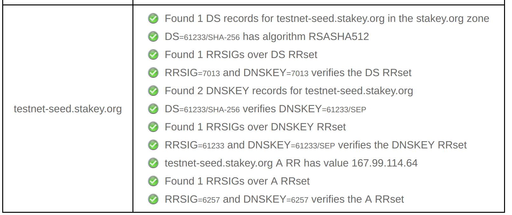
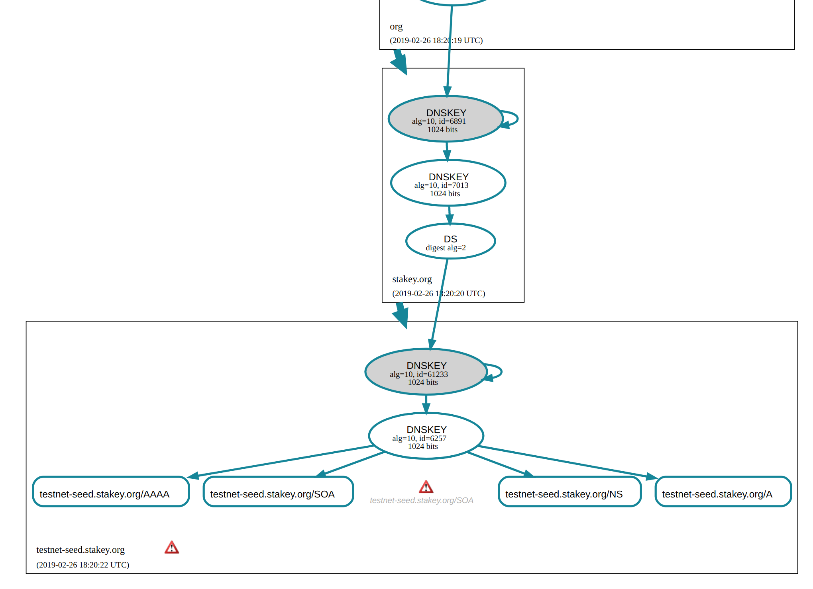

DNSSEC support
==============

This package implements DNSSEC extension in `dcrseeder`, in order to secure the DNS based seeding in `dcrd` against [DNS cache poisoning](https://core.ac.uk/download/pdf/81751050.pdf) attacks.
  
#### Implementation notes

The package adds several resource record types in addition to the `A` and `AAAA` RRs, and signs all RRs using an `RRSIG` record.

This is not a complete implementation of the DNSSEC extension as per [RFC4033](https://www.ietf.org/rfc/rfc4033.txt), only the resource types required to respond correctly to DNS requests from [dcrd](https://github.com/decred/dcrd) which can thus fully verify the integrity and authenticity of the seed IP addresses.  The seeder does conform to the DNSSEC protocol so that the zone it is serving is fully verifiable using DNSSEC validation tools such as [Verisign DNSSEC Analyzer](https://dnssec-analyzer.verisignlabs.com/) and [DNSViz](http://dnsviz.net).

#### Usage

See the documentation of the [dnssec-keygen](../cmd/dnssec-keygen) tool on how to generate the required keys and enable DNSSEC.

#### Additional information

* The  [DNS cache poisoning](https://core.ac.uk/download/pdf/81751050.pdf) attack vector
* For more information on DNSSEC see [How DNSSEC Works](https://www.cloudflare.com/dns/dnssec/how-dnssec-works/).
* [DNSSEC validation in Go for fun and profit](https://miek.nl/2011/january/02/dnssec-validation-in-go-for-fun-and-profit/)
